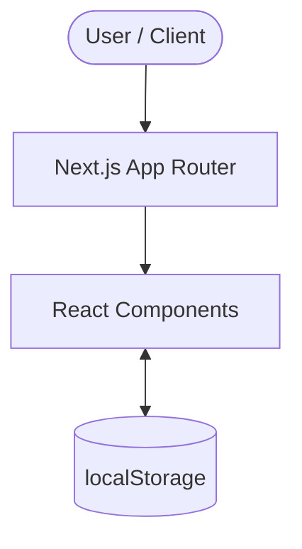

# Practice Assistant V2

---

## 概要

- 社労士向け業務支援AIプラットフォーム
- AIを安全に活用するための業務フロー管理
- AIは補助、人間が最終判断する設計
- **背景**: AI活用が進む専門職業務では、誤情報や根拠不明な出力をそのまま使うリスクがあります。そのため、本システムではAI出力を人間が確認・修正・却下し、Evidenceと紐付ける流れを重視しています。

---

## 主な機能

- **ダッシュボード**: 案件の進捗やタスクのサマリーを一目で把握できます。
- **案件管理**: 進行中・完了案件のCRUD操作を行い、状態を管理します。
- **業務フロー管理**: 業種別テンプレート（規程系・補助金系）で必要な工程を自動表示します。
- **AIヒアリング整理**: メモから事実関係や課題をAIが自動抽出し、担当者が3択（確認/修正/却下）で判断します。
- **AIタスクガイド**: 「どのAIに何を頼むか」をガイドし、プロンプトの作成を支援します。
- **Evidence管理**: AI出力に対する根拠（一次情報）のURLなどを紐付け、ハルシネーションを防ぎます。
- **Human Review**: AIの出力をそのまま使わず、必ず人間と専門家が確認・承認するフローを強制します。
- **補助金業務フロー**: 公募要項整理や必要資料整理など、補助金特有の4工程を管理します。
- **スマホ対応**: 全画面レスポンシブ対応で、外出先からでも確認・操作が可能です。

---

## システム構成



> **重要**: バックエンドなし、DBなし、認証なし、AI API連携なしの構成です。データはすべて `localStorage` を利用するデモ用途の設計となっています。

---

## 技術スタック

- Next.js 16.2.9
- React 19.2.4
- TypeScript 5
- Tailwind CSS 3.4.17
- localStorage
- Vercel
- GitHub

---

## ディレクトリ構成

```text
src/
├── app/
├── components/
│   ├── ui/
│   └── features/
├── hooks/
├── types/
└── config/
```

---

## 共通コンポーネント

| コンポーネント | 役割 |
| --- | --- |
| `CompletionActionArea` | 工程の完了ボタン・一時保存と進捗ステータスを管理 |
| `StatusBadge` | 確認・修正・却下などのステータスをアイコン付きで統一表示 |
| `Chip` | 優先度や状態などを柔軟な色・サイズで表示する汎用バッジ |
| `Button` | 画面全体で共通のプライマリ・セカンダリボタンスタイルを提供 |
| `HumanApprovalBadge` | 担当者や専門家による承認ステータスの表示・切り替え |

---

## 開発で重視した点

- AIを過信しない設計
- Evidence管理
- Human Review
- Presentational Component
- 責務分離
- 共通コンポーネント化
- スマホ対応
- 自動スクロール

---

## セットアップ

```bash
npm install
npm run dev
npm run build
```

---

## デモ

Vercel限定公開で動作確認済み

---

## 今後予定している改善

- 各画面のUI・UXのさらなるブラッシュアップ
- クラウドデータベースとの接続（本番運用向け）
- ユーザー認証および権限管理の導入
